# Gamified Note Taking App

A gamified web-based note taking app built with the PERN Stack.

## Tech Stack
- PostgreSQL
- ExpressJS
- ReactJS
- NodeJS

## Features
- XP and achievement system
- Streak-based rewards
- Knowledge management

## Screenshots

**Desktop**
<table>
  <tr>
    <td>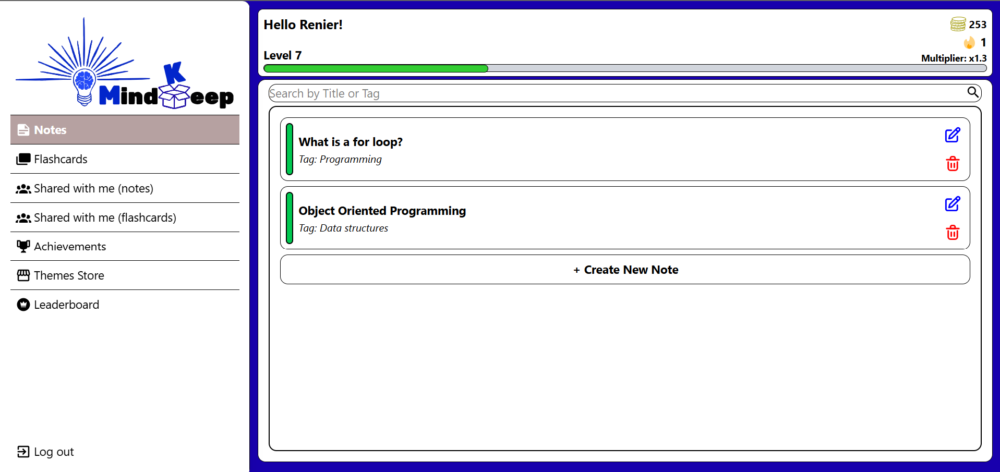</td>
  </tr>
  <tr>
    <td>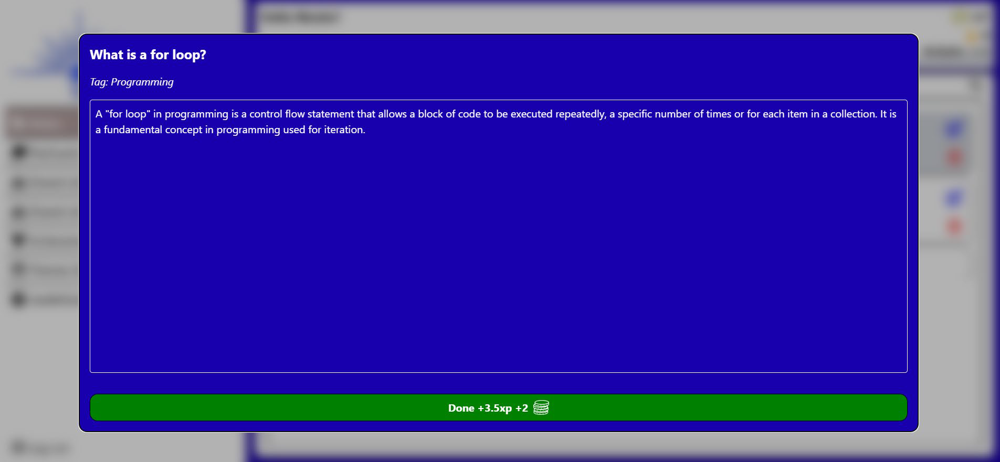</td>
  </tr>
  <tr>
    <td>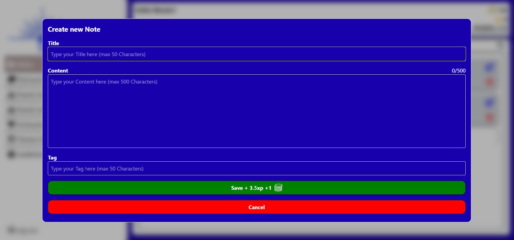</td>
  </tr>
  <tr>
    <td>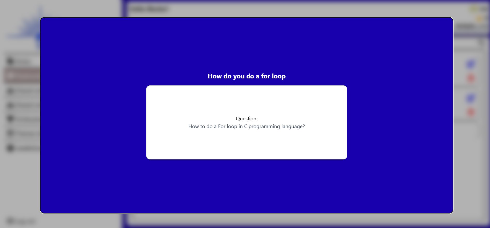</td>
  </tr>   
  <tr>  
    <td>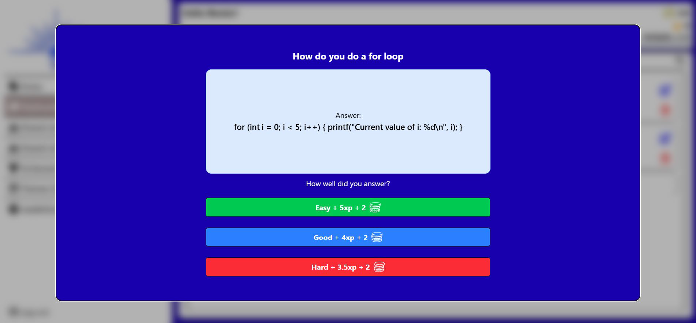</td>
  </tr>
  <tr>
    <td>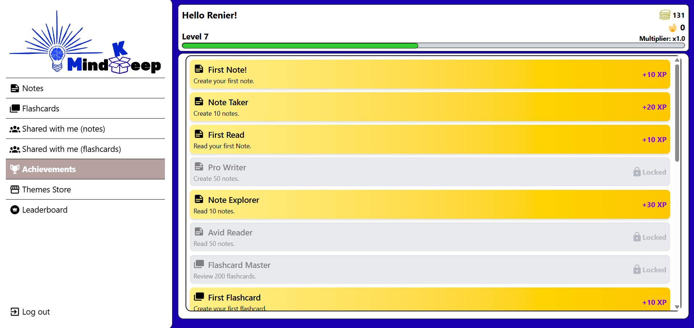</td>
  </tr>   
  <tr>   
    <td>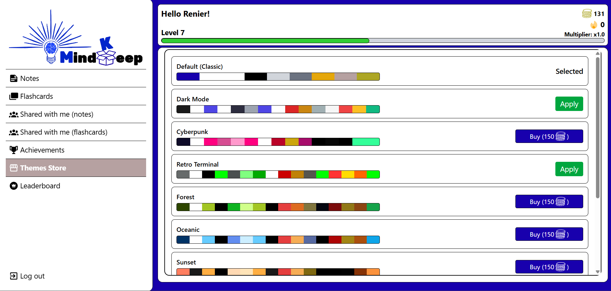</td>
  </tr>
  <tr>
    <td></td>
  </tr>  
</table>

**Mobile**
<table>
  <tr>
    <td>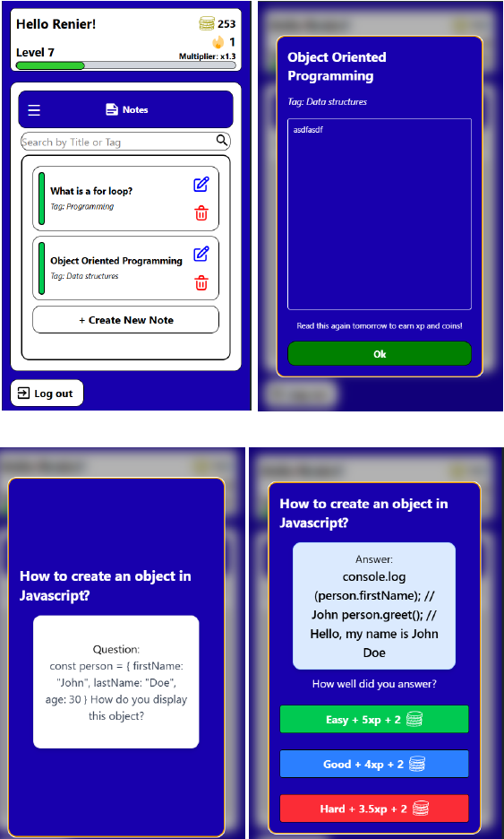</td>
    <td>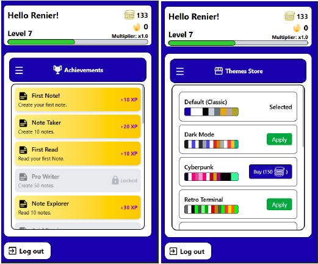</td>
  </tr>
  <tr>
    <td>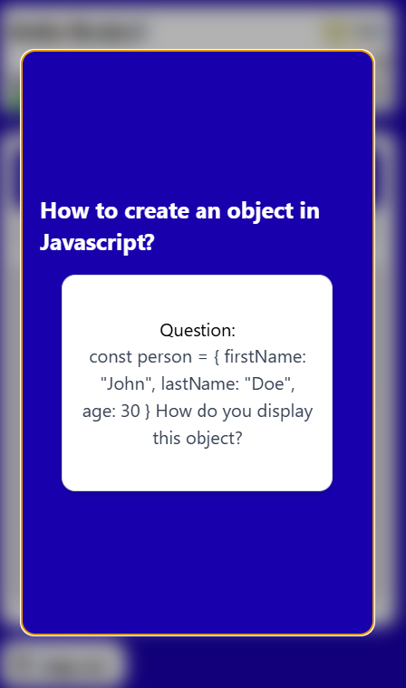</td>
    <td>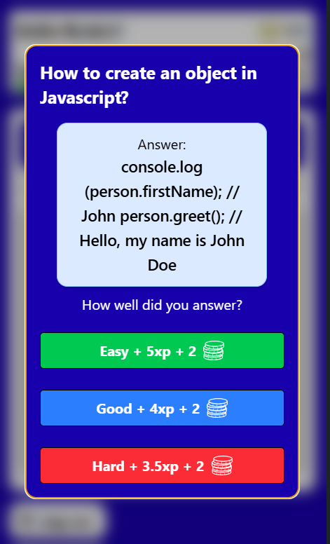</td>
  </tr>
  <tr>
    <td>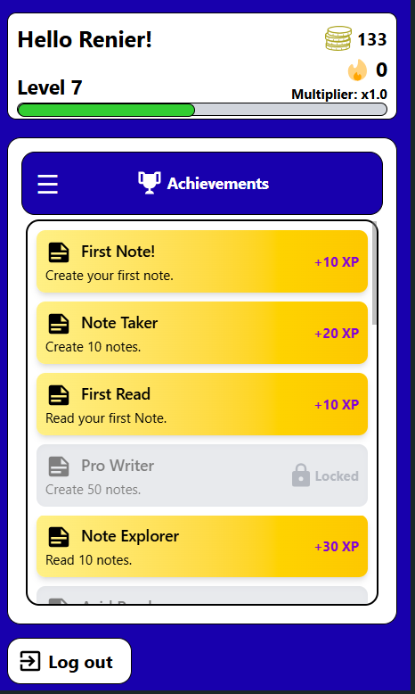</td>
    <td>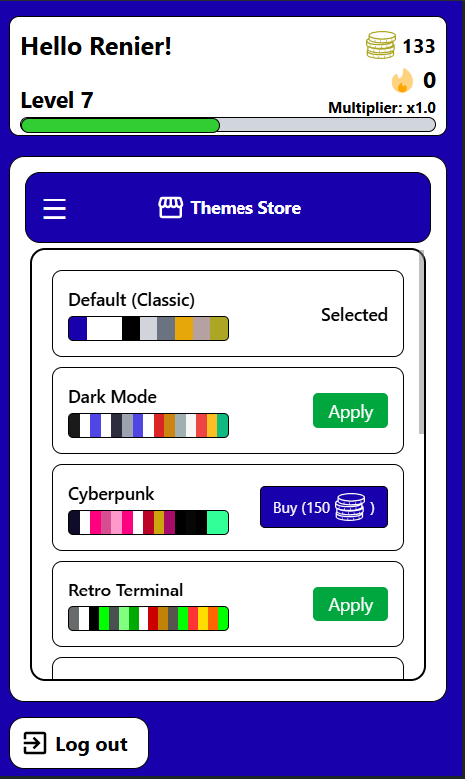</td>
  </tr>
</table>
